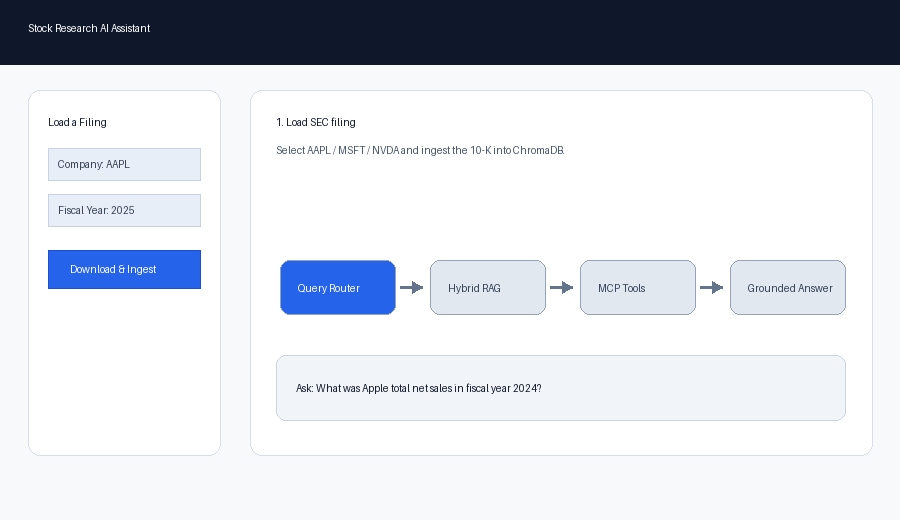
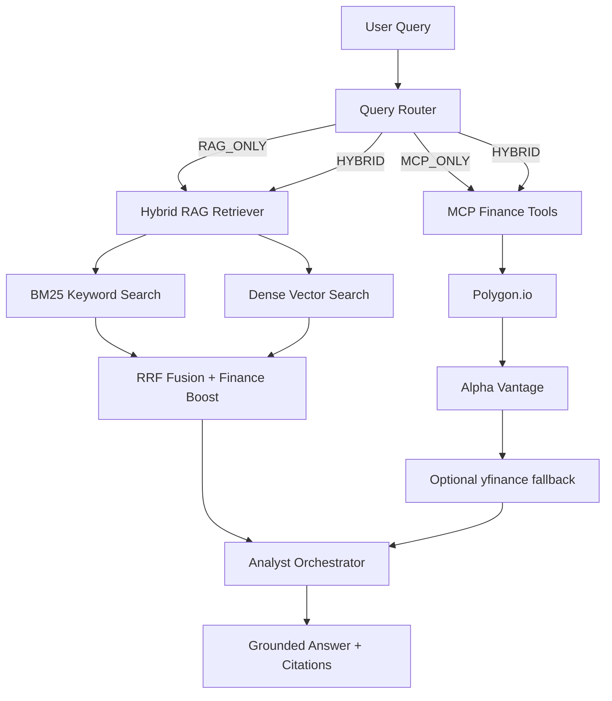

# Stock Research AI Assistant

A finance-domain AI assistant built around a **RAG + MCP architecture**. It combines SEC filing retrieval with live market-data tools so users can ask grounded stock research questions with citations.

Example questions:

- "What were Nvidia's main supply chain risks in its FY2025 10-K?"
- "What is Apple's current stock price and P/E ratio?"
- "Compare Nvidia's FY2025 gross margin with its current valuation."

The core idea is simple: **RAG handles historical filing knowledge, MCP handles live market data, and the agent decides when to use each source.**



## Current Status

This repo is a portfolio-grade MVP for SEC 10-K research over Apple, Microsoft, and Nvidia demo filings.

Latest RAGAS quality gate:

```text
Faithfulness:      0.9297  target >= 0.80
Answer Relevancy:  0.8600  target >= 0.75
Context Recall:    0.6007
Evaluated:         47
Failed:            0
```

`context_recall` is still below 0.70, but the current failure analysis shows a mix of retrieval gaps, eval-set mismatch, unsupported valuation capabilities, and market-data availability limits rather than a simple generation prompt issue.

## Why RAG + MCP

Financial research questions usually need two different types of information:

- **Primary-source document evidence** from SEC filings, such as revenue, segment performance, risk factors, MD&A commentary, and financial statements.
- **Current market data** such as price, valuation ratios, market cap, earnings dates, and peer comparisons.

Pure RAG is not enough because filings are historical and cannot answer live market questions. Pure API tooling is also not enough because market data APIs do not contain the detailed management commentary and risk disclosures inside 10-K filings.

This project uses both:

- **RAG pipeline**: parses SEC filings, creates finance-aware chunks, stores embeddings in ChromaDB, and retrieves evidence with hybrid search.
- **MCP server**: exposes finance tools through FastMCP and returns structured JSON with a `data_source` field.
- **Agent layer**: classifies each query as `RAG_ONLY`, `MCP_ONLY`, or `HYBRID`, then synthesizes an answer with citations.

## Architecture



## Project Structure

```text
.
├── app.py                     # Streamlit UI
├── edgar.py                   # SEC EDGAR download and ingestion helper
├── rag/
│   ├── chunker.py             # Structure-aware chunking
│   ├── ingest.py              # PDF -> chunks -> embeddings -> ChromaDB
│   ├── retriever.py           # Hybrid retrieval: BM25 + vector + RRF
│   └── chroma_client.py       # Shared ChromaDB client
├── tools/
│   └── stock_server.py        # FastMCP finance tools
├── agent/
│   ├── router.py              # Query classifier
│   └── analyst.py             # RAG/MCP orchestration and answer synthesis
├── eval/
│   └── ragas_eval.py          # RAGAS evaluation pipeline
├── docs/
│   ├── assets/demo.gif        # README demo walkthrough
│   └── interview_notes.md     # Sprint 4 interview prep notes
├── tests/
│   └── query_eval_set.json    # Labelled evaluation queries
└── data/pdfs/                 # Demo SEC filing PDFs
```

## Key Design Decisions

### 1. Hybrid Retrieval Instead of Pure Vector Search

The retriever uses **BM25 + dense vector search + Reciprocal Rank Fusion**.

This matters in finance because exact terms like `EBITDA`, `Form 10-K`, `Item 7`, `Data Center`, or ticker-specific language are often better captured by keyword retrieval, while semantic retrieval is better for broad management commentary questions.

### 2. Structure-Aware Chunking

Narrative filing sections use sliding-window chunking, while financial statement table sections are kept as whole chunks.

This avoids a common finance RAG failure mode: fixed-size chunking can split financial tables mid-row, causing the model to lose the relationship between line items, years, and values.

### 3. MCP for Live Market Data

The MCP server exposes finance tools such as stock price and fundamentals lookup. Tool responses include `data_source`, so the answer layer can distinguish between filing evidence and live API data.

Market data fallback order:

```text
Polygon.io -> Alpha Vantage -> yfinance
```

`yfinance` is treated as an optional last-resort fallback because it is less reliable for production-style financial workflows.

### 4. Query Routing

The router classifies each query before retrieval:

- `RAG_ONLY`: filing-specific questions
- `MCP_ONLY`: live market-data questions
- `HYBRID`: questions requiring both filing evidence and market data

This keeps the system efficient and makes the data-source boundary explicit.

## Tech Stack

- **Frontend**: Streamlit
- **RAG**: ChromaDB, sentence-transformers, BM25
- **Embedding model**: `BAAI/bge-small-en-v1.5`
- **MCP**: FastMCP
- **Market data**: Polygon.io, Alpha Vantage, optional yfinance fallback
- **LLM orchestration**: OpenAI client
- **Evaluation**: RAGAS
- **PDF parsing**: pdfplumber

## Quickstart

These steps assume the local conda environment described in `AGENTS.md`:

```bash
conda activate finance_rag
```

Install dependencies:

```bash
pip install -r requirements.txt
```

Create `.env` in the repo root:

```bash
OPENAI_API_KEY=your_openai_key
POLYGON_API_KEY=your_polygon_key
ALPHA_VANTAGE_API_KEY=your_alpha_vantage_key
ENABLE_YFINANCE_FALLBACK=false
```

Ingest the bundled demo filings:

```bash
python rag/ingest.py
```

Run the Streamlit app:

```bash
streamlit run app.py
```

Open the local Streamlit URL shown in the terminal, select a company/year in the sidebar, and ask a query.

## Demo Flow

1. Select a company in the sidebar: `AAPL`, `MSFT`, or `NVDA`.
2. Select a fiscal year from the available SEC filings.
3. Click `Download & Ingest` if the filing has not been indexed yet.
4. Ask a question in the chat box.
5. Inspect the response, query type, filing citations, and live market-data outputs.

Good demo queries:

```text
What was Apple's total net sales in fiscal year 2024?
What were Nvidia's main risk factors in its latest 10-K?
What is Apple's current stock price?
Compare Apple's reported revenue with its current valuation.
```

Expected behavior:

- Filing questions should route to `RAG_ONLY` and cite SEC sections/pages.
- Market-data questions should route to `MCP_ONLY` and show `data_source`.
- Mixed questions should route to `HYBRID` and use both filing evidence and tool outputs.

## Evaluation

Run the full RAGAS harness:

```bash
python eval/ragas_eval.py
```

The harness writes aggregate and per-question artifacts to `eval/results/`:

```text
eval/results/ragas_*.json
eval/results/ragas_details_*.json
eval/results/ragas_details_*.csv
```

Per-question details include:

- generated answer
- expected answer
- query type
- retrieved context preview
- retrieved context metadata
- router decision
- MCP tool outputs
- faithfulness, answer relevancy, and context recall where applicable

Latest recorded result:

```text
eval/results/ragas_20260504T073612.json
```

## Interview Notes

Sprint 4 interview preparation notes are in:

- [docs/interview_notes.md](docs/interview_notes.md)

They cover:

- structure-aware chunking
- hybrid retrieval rationale
- MCP vs direct API calls
- evaluation methodology
- limitations and follow-up roadmap

## Current Scope

The current project is a portfolio-grade MVP focused on:

- SEC 10-K filing analysis
- Hybrid document retrieval
- Live market-data tool calls
- Query routing between RAG and MCP
- Citation-aware answer generation
- RAGAS-based evaluation

Future improvements include broader SEC filing support, stronger table extraction, multi-company hybrid comparison, and production-grade MCP tool coverage.

## Known Limitations

- Multi-company HYBRID comparison is not fully implemented yet.
- Some valuation questions are marked as `unsupported_capability` because they require a valuation model or peer/segment valuation framework.
- Some MCP fields depend on free-tier API coverage and may return structured unavailable responses.
- `yfinance` is an optional last-resort fallback and is disabled by default to avoid rate-limit noise during evaluation.
